# Term Project II: Quantitative Trading Final Report

## 0. Executive Summary

本報告完成兩個問題：Problem 1 使用五檔股票進行規則型投資策略設計與比較；Problem 2 使用同一組股票建立 pairs trading 策略。全部結果皆與 Buy-and-Hold / Lump-Sum 和 DCA 比較，並保留可重現的 Python 腳本、CSV 結果、圖表與 PPT。

- Problem 1 五檔股票：AAPL、MSFT、V、MA、JPM。資料自 2006 年起，單股走勢圖使用 2016 年後約 10 年資料。
- Problem 1 單股規則：使用 GA 在 2006-2015 訓練期選出 Trend-Stop + Momentum Re-entry 參數，再固定參數測試 2016-2026。
- GA 結果：單次 2006-2015 訓練、2016-2026 測試下，五檔 GA 策略都贏過 DCA；walk-forward 檢查中，2016-2026 年度平均也在五檔都贏固定參數與 DCA。
- Problem 1 五檔組合規則：Dual Momentum + Trend Filter + Volatility Control，用於 temporal validation 的五檔輪動。
- Problem 2 規則：固定使用 Visa-Mastercard (`V-MA`) 這組有名的同產業支付網路 pair，使用 classic z-score pairs trading；ADF 與 half-life 改為診斷資訊，GA 只用測試年前資料挑交易參數。
- 主要解讀：規則策略不是保證打敗 Buy&Hold；它的價值在於讓進出場邏輯可解釋，並能討論何時有效、何時失效。

## 1. Professor Requirement Checklist

| Requirement | Status | Evidence |
| --- | --- | --- |
| 選 5 檔上市股票 | 完成 | AAPL, MSFT, V, MA, JPM |
| 歷史資料要足夠長，最好超過 10 年 | 完成 | 資料自 2006 年起；圖表使用 2016-2026 |
| 每檔股票至少一個 rule-based strategy | 完成 | GA-optimized Trend-Stop + Momentum Re-entry |
| 與 Buy-and-Hold / Lump-Sum 比較 | 完成 | 每檔圖與 summary CSV 皆包含 |
| 與 Dollar-Cost Averaging 比較 | 完成 | 每檔圖與 summary CSV 皆包含 |
| 指標含 annualized return / cumulative return / MDD / risk | 完成 | results/*.csv |
| 使用 temporal validation，不做 random split | 完成 | expanding yearly windows + GA walk-forward |
| 加入 Genetic Algorithm | 完成 | P1 單股參數與 P2 pairs 參數皆只用測試年前資料最佳化 |
| Problem 2 pairs trading | 完成 | 固定使用 V-MA pair；training data 只用來檢查相關與共整合並調參 |
| Tables and figures | 完成 | figures/、results/、ppt/ |
| 限制與改進 | 完成 | 本報告第 8 節 |
| Individual contribution statement | 完成 | 本報告第 9 節 |

## 2. Data and Benchmark Design

- Data source: `yfinance` 下載每日 OHLCV，主要使用 adjusted close / close price 做回測。
- Initial capital: 每檔股票 USD 10,000。
- Buy-and-Hold / Lump-Sum: 第一天一次投入全部本金，之後長抱。
- DCA: 將 USD 10,000 平均分成每月第一個交易日投入，直到資金投入完畢。
- Transaction cost: Problem 1 單邊 10 bps；Problem 2 單邊 5 bps。
- Temporal validation: 以 expanding yearly windows 做逐年測試，避免金融時間序列被 random split 破壞時間順序。

## 3. Strategy Design

### Problem 1A: Five-Stock Portfolio Strategy

五檔組合策略使用 Dual Momentum + Trend Filter + Volatility Control：

- 每 21 個交易日重新平衡。
- 先看 252 日動能，動能為正且價格高於 200 日均線才可進入候選。
- 從候選股票中選動能最高的前 2 檔。
- 用 inverse volatility 分配權重，再用目標波動與波動上限控制總曝險。
- 此策略用於 Problem 1 的 temporal validation 與五檔整體圖。

### Problem 1B: Single-Stock Rule Strategy with GA

單股圖不能直接套五檔輪動的相對動能，因為相對動能會把其他股票納入判斷，導致「某檔股票自己表現不差，但因為輸給其他股票就被迫空手」。所以每檔股票改用單股規則，並用 GA 在訓練期選參數：

這裡的 `stop` 指的是回撤停損 / trailing stop 門檻。例如 `Stop = 20%` 不是固定跌到某個價格才賣，而是指股價從進場後或持有期間高點回跌 20% 以上，並且跌破 GA 選定的 moving average，策略才出場。

```text
平常持有股票
如果從高點跌超過 GA 選定的 trailing_stop_pct，且價格跌破 GA 選定的 moving average -> 出場
出場後，若價格重新站上該 moving average，且 GA 選定 lookback 的 momentum 轉正 -> 重新進場
```

這個設計的目的不是預測價格，而是用明確規則處理三件事：保留長期趨勢、避開部分深跌、在趨勢恢復後重新進場。

### Genetic Algorithm Design

GA 不是用來預測股價，而是用來搜尋規則策略的參數。為避免 look-ahead bias，GA 的正式單次測試只能使用 2006-2015 的 training data；2016-2026 的 testing data 完全不參與參數選擇。新增的 walk-forward 檢查則是每一年都重新只用該年前的資料挑參數，再測下一年。

GA 的計算流程如下：先隨機產生一組候選參數 population，並把原固定參數放進初始族群當 baseline；每一代都把每個 chromosome 轉成一個完整策略回測，計算 training-only fitness；保留前幾名 elite，其他候選由 crossover 混合父母參數，再用 mutation 小幅改 stop / MA / momentum。最後只把 training data 中 fitness 最高的參數拿去 2016-2026 測試。

- Chromosome: `(trailing_stop_pct, reentry_ma_window, momentum_lookback)`。
- Search range: `trailing_stop_pct = 18%-35%`，`reentry_ma = 50-200 days`，`momentum_lookback = 63-252 days`。
- Population size: 28；generations: 22；保留前 4 名 elite。
- Fitness: 訓練期內的 return / drawdown / volatility / turnover / exposure 綜合分數，且加入前段與後段訓練期穩定性懲罰。
- Volatility usage: 單股 GA 的進出場訊號不是直接由 volatility 觸發；volatility 是 fitness 的風險懲罰項。真正直接使用 inverse volatility / vol cap 的是 Problem 1A 的五檔組合策略。
- Anti-leakage: GA 找參數時不讀取 2016-2026 的測試績效；測試結果只用於最後評估。

| Ticker | GA Stop | GA MA | GA Momentum | 參數影響 | GA Test Cum. | Fixed Test Cum. | Delta | GA > Fixed |
| --- | --- | --- | --- | --- | --- | --- | --- | --- |
| AAPL | 20.00% | 75 | 99 | 停損同固定參數; 均線較短：較快重新進場，但假突破風險較高; 動能視窗較短：訊號較快、較敏感 | 605.36% | 524.02% | 81.34% | True |
| MSFT | 20.50% | 121 | 72 | 停損較寬：比較不容易被洗出場，但可能承受較深回撤; 均線較長：進場確認較慢、較保守; 動能視窗較短：訊號較快、較敏感 | 473.12% | 600.51% | -127.39% | False |
| V | 18.00% | 96 | 67 | 停損較緊：較早出場避險，但容易錯過 V 型反彈; 均線較短：較快重新進場，但假突破風險較高; 動能視窗較短：訊號較快、較敏感 | 113.40% | 178.33% | -64.93% | False |
| MA | 29.00% | 133 | 86 | 停損較寬：比較不容易被洗出場，但可能承受較深回撤; 均線較長：進場確認較慢、較保守; 動能視窗較短：訊號較快、較敏感 | 351.88% | 134.35% | 217.53% | True |
| JPM | 33.00% | 55 | 87 | 停損較寬：比較不容易被洗出場，但可能承受較深回撤; 均線較短：較快重新進場，但假突破風險較高; 動能視窗較短：訊號較快、較敏感 | 448.19% | 380.85% | 67.34% | True |

### GA Walk-Forward Check

因資料從 2006 開始，不能真的從 2006 就測 GA，否則沒有更早的訓練資料。本報告採用五年起始訓練期：`2006-2010 train -> 2011 test`，逐年展開到 2026。這個結果用來檢查 GA 不是只剛好適合單一切割。

Internal validation period: 2011-2015

| Ticker | GA Avg Year Cum. | Fixed Avg Year Cum. | DCA Avg Year Cum. | B&H Avg Year Cum. | Read |
| --- | --- | --- | --- | --- | --- |
| AAPL | 21.85% | 25.27% | 8.60% | 19.75% | 需保守解讀 |
| MSFT | 17.54% | 17.54% | 9.58% | 17.54% | 需保守解讀 |
| V | 27.28% | 27.28% | 19.82% | 27.28% | GA 不輸固定且贏 DCA |
| MA | 37.11% | 37.11% | 21.55% | 37.11% | 需保守解讀 |
| JPM | 4.84% | 9.70% | 6.68% | 11.72% | 需保守解讀 |

Out-of-sample period: 2016-2026

| Ticker | GA Avg Year Cum. | Fixed Avg Year Cum. | DCA Avg Year Cum. | B&H Avg Year Cum. | Read |
| --- | --- | --- | --- | --- | --- |
| AAPL | 21.11% | 20.81% | 18.02% | 31.23% | GA 不輸固定且贏 DCA |
| MSFT | 24.14% | 22.86% | 12.46% | 25.58% | GA 不輸固定且贏 DCA |
| V | 12.65% | 11.45% | 7.43% | 15.70% | GA 不輸固定且贏 DCA |
| MA | 14.47% | 9.25% | 8.74% | 18.19% | GA 不輸固定且贏 DCA |
| JPM | 17.84% | 14.78% | 14.81% | 19.18% | GA 不輸固定且贏 DCA |

Walk-forward 結論：年度平均表用來檢查 GA 是否只適合單一切割；若 GA 只在少數股票有效，就要在限制中誠實說明 overfitting / whipsaw 風險。

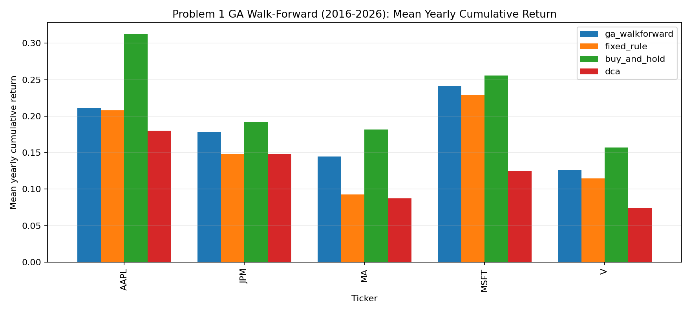


### Problem 2: Pairs Trading Strategy

Pairs trading 的假設是：兩檔股票若長期存在穩定關係，短期 spread 偏離後可能回歸。設計如下：

- 使用同一組五檔股票中的 `V-MA` 作為固定 pair。選它不是因為測試期績效最好，而是因為 Visa 與 Mastercard 屬於同產業、商業模式相近、價格長期高度相關，報告上更容易解釋。
- 候選 pair 表仍保留 cointegration / correlation 檢查；但正式策略不再每年切換 pair，避免研究設計前後不一致。
- 對兩檔股價取 log，使用 OLS / rolling beta 定義 spread。
- 使用 40 日 rolling z-score 作為 fixed baseline 的進出場訊號；GA 版本則在 30-90 日區間內自行選 lookback。
- Fixed baseline 使用 `z <= -1.5` 做 long spread，`z >= 1.5` 做 short spread。
- `z` 依方向回到 0 附近平倉；`|z| >= 3.5` 停損；最長持有 60 天。
- ADF p-value 與 half-life 這版不再當硬性進場 filter，而是作為診斷資訊。原因是前一版 filter 太嚴，導致策略過度空手，看起來不像真的 pairs trading。
- 固定參數版本使用乾淨的事前 baseline：`lookback=40`、`entry_z=1.5`、`exit_z=0.0`、`stop_z=3.5`、`max_holding_days=60`。這組不是從 2016-2026 測試期調出來，而是 pairs trading 常見的 classic z-score rule。
- GA 版本不改變策略架構，只搜尋 `lookback / entry_z / exit_z / stop_z / max_holding_days`。正式測試窗只有 `2016-2026`；GA 只用 2015 年底以前資料做內部 formation/validation，因此不偷看測試期。
- P2 GA 的 chromosome 實際儲存 7 個欄位：`lookback / entry_z / exit_z / stop_z / max_holding_days / ADF p-value threshold / max half-life`。但本版 `use_regime_filter=False`，所以真正影響交易的是前 5 個；ADF 與 half-life 只保留為診斷與未來擴充，不再硬擋交易。
- P2 GA 搜尋範圍：lookback 30-90、entry_z 1.0-2.5、exit_z 0-0.6、stop_z 2.5-4.2、max hold 20-80；population 18、generations 12、elite 4。
- P2 fitness 主要獎勵 validation return，懲罰 drawdown、volatility、零交易與過少交易，目的是找出更穩定的 spread-trading 規則，而不是改變 pair。

Pair choice is not random. The formal report uses the fixed famous pair `V-MA`; the table below shows its pre-2016 training-period correlation is very high. Other screened candidates are kept in `results/reco_problem2_pair_selection.csv` only as comparison evidence, not as formal strategy choices:

| Window | Rank | Pair | Train Corr. | Coint p-value | Selected |
| --- | --- | --- | --- | --- | --- |
| 2016-2026 | 5 | V-MA | 0.993 | 0.2381 | True |

## 4. Problem 1 Performance Summary

| Ticker | GA Ann. | GA Cum. | GA MDD | Fixed Cum. | DCA Cum. | B&H Cum. | Main Read |
| --- | --- | --- | --- | --- | --- | --- | --- |
| AAPL | 20.79% | 605.36% | -46.44% | 524.02% | 356.30% | 1166.31% | GA 贏原固定規則與 DCA，但輸 Buy&Hold。 |
| MSFT | 18.39% | 473.12% | -37.13% | 600.51% | 215.21% | 781.31% | GA 贏 DCA，但輸原固定規則與 Buy&Hold。 |
| V | 7.61% | 113.40% | -43.94% | 178.33% | 109.37% | 363.46% | GA 贏 DCA，但輸原固定規則與 Buy&Hold。 |
| MA | 15.70% | 351.88% | -32.08% | 134.35% | 118.73% | 455.33% | GA 贏原固定規則與 DCA，但輸 Buy&Hold。 |
| JPM | 17.88% | 448.19% | -41.71% | 380.85% | 189.32% | 515.30% | GA 贏原固定規則與 DCA，但輸 Buy&Hold。 |

整體來看，GA 單股策略不應只看訓練期好壞；若測試期輸給固定參數或 Buy&Hold，代表最佳化可能貼合 training period，因此必須做 out-of-sample 與 walk-forward 檢查。

注意：下圖 `Problem 1 Universe` 是五檔股票的綜合組合圖。藍線不是某一檔股票，而是五檔 universe 依 Dual Momentum + Trend + VolCap 規則形成的組合；橘線與綠線也是五檔等權 Buy&Hold / DCA。每檔單股的 GA 圖在下一張 gallery 與第 5 節。

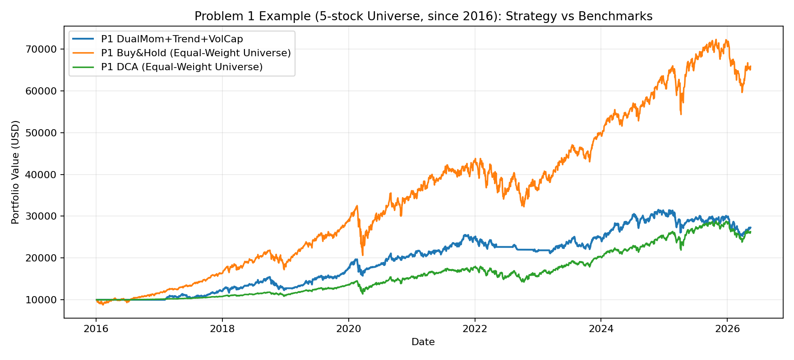

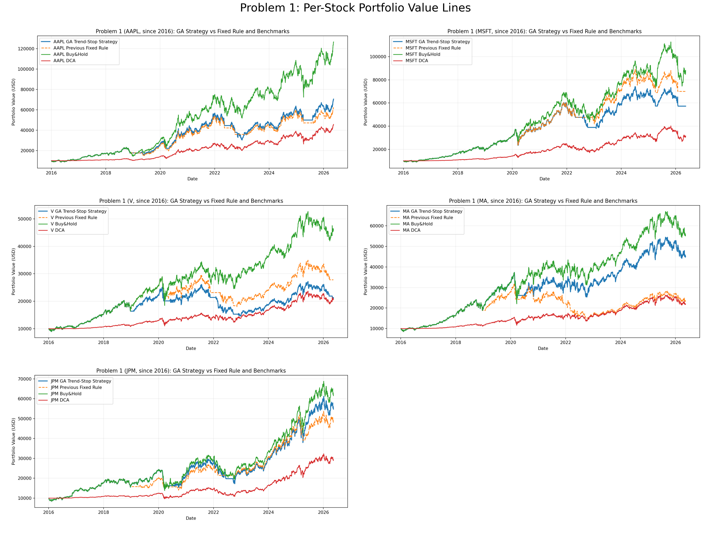

## 5. Problem 1 Stock-by-Stock Interpretation

### AAPL

- 走勢摘要：AAPL 從 2016-01-04 到 2026-05-15 累積上漲 1166.31%；最強 6 個月是 2020-03-23 到 2020-09-21，漲幅 97.13%。
- 最大價格回撤：2018-10-03 到 2019-01-03，價格最大回撤 -38.52%；策略最大回撤是 2022-01-03 到 2023-01-05，回撤 -46.44%。
- GA 最後參數：trailing stop 20.00%、re-entry MA 75 日、momentum lookback 99 日。相對固定參數的意義：停損同固定參數; 均線較短：較快重新進場，但假突破風險較高; 動能視窗較短：訊號較快、較敏感。
- 績效比較：GA 策略累積 605.36%，原固定規則 524.02%，DCA 356.30%，Buy&Hold 1166.31%。GA 贏原固定規則與 DCA，但輸 Buy&Hold。
- 為什麼比 DCA 好：DCA 分批投入會保留現金，若股票長期上漲，資金進場較慢；本策略大多在趨勢仍有效時保持持倉，因此比 DCA 更早參與上漲。
- 為什麼輸 Buy&Hold：Buy&Hold 在強多頭股票上永遠滿倉；策略只要有出場或重新進場延遲，就會少吃一段反彈。
- GA 是否比原參數好：是。GA 在 2006-2015 訓練期找到更適合此股票的 stop / MA / momentum 組合，2016-2026 測試期也優於原固定規則。
- 關鍵轉折點數量：共 10 次倉位變化，出場 5 次，重新進場 5 次。

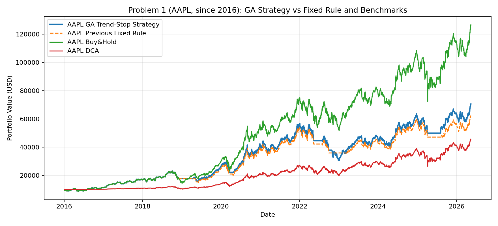

關鍵事件解釋：

以下每一列都用同一個邏輯讀：GA 當時根據 stop / MA / momentum 做出進出場，後續股價變化就是這個決策造成的績效走向。

- 2020-04-29 重新進場 -> 2022-05-12：因為價格重新站上 GA 的 75 日均線 0.22%，且 99 日 momentum 為 8.60%；當時 63 日年化波動約 70.24%，後續股價變化 101.20%。這段進場有效，因為重新進場後到下一次訊號前股價上漲。這和 GA 參數有關：停損同固定參數; 均線較短：較快重新進場，但假突破風險較高; 動能視窗較短：訊號較快、較敏感。
- 2025-08-06 重新進場 -> 2026-05-15：因為價格重新站上 GA 的 75 日均線 3.78%，且 99 日 momentum 為 0.02%；當時 63 日年化波動約 23.92%，後續股價變化 41.35%。這段進場有效，因為重新進場後到下一次訊號前股價上漲。這和 GA 參數有關：停損同固定參數; 均線較短：較快重新進場，但假突破風險較高; 動能視窗較短：訊號較快、較敏感。
- 2022-10-28 重新進場 -> 2025-04-03：因為價格重新站上 GA 的 75 日均線 0.42%，且 99 日 momentum 為 5.40%；當時 63 日年化波動約 35.93%，後續股價變化 32.20%。這段進場有效，因為重新進場後到下一次訊號前股價上漲。這和 GA 參數有關：停損同固定參數; 均線較短：較快重新進場，但假突破風險較高; 動能視窗較短：訊號較快、較敏感。

| Date | Action | Price | DD from Peak | GA Mom. | Price vs MA | 63D Vol. | Next Date | Price Move | Interpretation |
| --- | --- | --- | --- | --- | --- | --- | --- | --- | --- |
| 2018-11-20 | Exit | 41.99 | -23.47% | -4.79% | -17.59% | 33.77% | 2019-04-08 | 13.55% | 失敗：出場後股價反彈，策略少吃一段上漲。 |
| 2019-04-08 | Re-entry | 47.68 | -13.10% | 3.50% | 17.77% | 23.50% | 2020-03-12 | 25.68% | 成功：重新進場後股價上漲，策略重新跟上趨勢。 |
| 2020-03-12 | Exit | 59.92 | -24.14% | 5.56% | -15.80% | 47.07% | 2020-04-29 | 15.91% | 失敗：出場後股價反彈，策略少吃一段上漲。 |
| 2020-04-29 | Re-entry | 69.46 | -12.06% | 8.60% | 0.22% | 70.24% | 2022-05-12 | 101.20% | 成功：重新進場後股價上漲，策略重新跟上趨勢。 |
| 2022-05-12 | Exit | 139.75 | -21.46% | -15.79% | -13.80% | 35.04% | 2022-07-29 | 13.99% | 失敗：出場後股價反彈，策略少吃一段上漲。 |
| 2022-07-29 | Re-entry | 159.31 | -10.47% | 3.37% | 9.11% | 39.82% | 2022-09-30 | -14.84% | 失敗：重新進場後價格下跌，屬於二次回落或假突破。 |
| 2022-09-30 | Exit | 135.67 | -20.82% | -10.43% | -10.19% | 30.64% | 2022-10-28 | 12.69% | 失敗：出場後股價反彈，策略少吃一段上漲。 |
| 2022-10-28 | Re-entry | 152.89 | -10.78% | 5.40% | 0.42% | 35.93% | 2025-04-03 | 32.20% | 成功：重新進場後股價上漲，策略重新跟上趨勢。 |
| 2025-04-03 | Exit | 202.12 | -21.47% | -10.48% | -13.30% | 33.60% | 2025-08-06 | 5.09% | 失敗：出場後股價反彈，策略少吃一段上漲。 |
| 2025-08-06 | Re-entry | 212.41 | -17.47% | 0.02% | 3.78% | 23.92% | 2026-05-15 | 41.35% | 成功：重新進場後股價上漲，策略重新跟上趨勢。 |

### MSFT

- 走勢摘要：MSFT 從 2016-01-04 到 2026-05-15 累積上漲 781.31%；最強 6 個月是 2020-03-16 到 2020-09-14，漲幅 52.47%。
- 最大價格回撤：2021-11-19 到 2022-11-03，價格最大回撤 -37.15%；策略最大回撤是 2020-02-10 到 2020-03-16，回撤 -37.13%。
- GA 最後參數：trailing stop 20.50%、re-entry MA 121 日、momentum lookback 72 日。相對固定參數的意義：停損較寬：比較不容易被洗出場，但可能承受較深回撤; 均線較長：進場確認較慢、較保守; 動能視窗較短：訊號較快、較敏感。
- 績效比較：GA 策略累積 473.12%，原固定規則 600.51%，DCA 215.21%，Buy&Hold 781.31%。GA 贏 DCA，但輸原固定規則與 Buy&Hold。
- 為什麼比 DCA 好：DCA 分批投入會保留現金，若股票長期上漲，資金進場較慢；本策略大多在趨勢仍有效時保持持倉，因此比 DCA 更早參與上漲。
- 為什麼輸 Buy&Hold：Buy&Hold 在強多頭股票上永遠滿倉；策略只要有出場或重新進場延遲，就會少吃一段反彈。
- GA 是否比原參數好：否。GA 在訓練期找到較高分參數，但測試期輸給原固定規則，代表參數對訓練期型態有 overfitting 或 whipsaw 問題。
- 關鍵轉折點數量：共 9 次倉位變化，出場 5 次，重新進場 4 次。

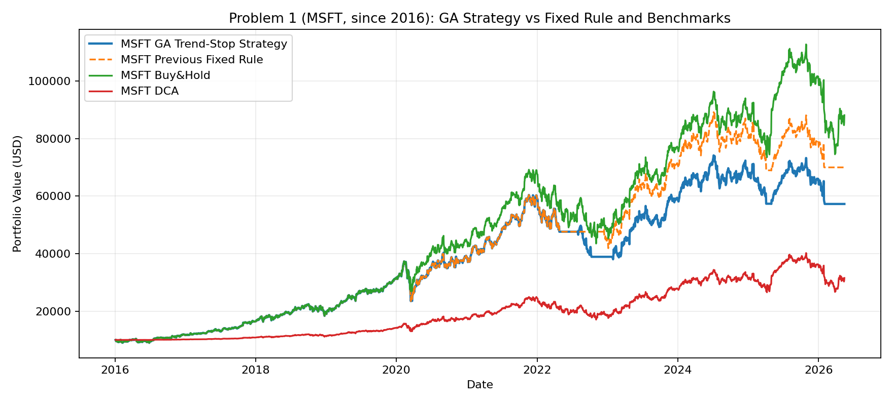

關鍵事件解釋：

以下每一列都用同一個邏輯讀：GA 當時根據 stop / MA / momentum 做出進出場，後續股價變化就是這個決策造成的績效走向。

- 2020-03-13 重新進場 -> 2022-04-26：因為價格重新站上 GA 的 121 日均線 2.51%，且 72 日 momentum 為 4.56%；當時 63 日年化波動約 52.12%，後續股價變化 73.26%。這段進場有效，因為重新進場後到下一次訊號前股價上漲。這和 GA 參數有關：停損較寬：比較不容易被洗出場，但可能承受較深回撤; 均線較長：進場確認較慢、較保守; 動能視窗較短：訊號較快、較敏感。
- 2023-01-26 重新進場 -> 2025-04-04：因為價格重新站上 GA 的 121 日均線 0.40%，且 72 日 momentum 為 10.17%；當時 63 日年化波動約 39.14%，後續股價變化 47.77%。這段進場有效，因為重新進場後到下一次訊號前股價上漲。這和 GA 參數有關：停損較寬：比較不容易被洗出場，但可能承受較深回撤; 均線較長：進場確認較慢、較保守; 動能視窗較短：訊號較快、較敏感。
- 2025-04-04 出場 -> 2025-05-01：因為股價相對高點回撤 -22.59%，已超過 GA stop -20.50%，且價格低於 GA 的 121 日均線 -13.28%；當時 63 日年化波動約 26.59%，後續股價變化 18.22%。這段出場反而吃虧，因為下一次訊號前股價反彈，策略少吃反彈。這和 GA 參數有關：停損較寬：比較不容易被洗出場，但可能承受較深回撤; 均線較長：進場確認較慢、較保守; 動能視窗較短：訊號較快、較敏感。

| Date | Action | Price | DD from Peak | GA Mom. | Price vs MA | 63D Vol. | Next Date | Price Move | Interpretation |
| --- | --- | --- | --- | --- | --- | --- | --- | --- | --- |
| 2020-03-12 | Exit | 132.09 | -26.10% | -8.28% | -10.16% | 43.56% | 2020-03-13 | 14.22% | 失敗：出場後股價反彈，策略少吃一段上漲。 |
| 2020-03-13 | Re-entry | 150.87 | -15.60% | 4.56% | 2.51% | 52.12% | 2022-04-26 | 73.26% | 成功：重新進場後股價上漲，策略重新跟上趨勢。 |
| 2022-04-26 | Exit | 261.40 | -21.08% | -14.03% | -12.97% | 34.11% | 2022-07-29 | 4.14% | 失敗：出場後股價反彈，策略少吃一段上漲。 |
| 2022-07-29 | Re-entry | 272.21 | -17.82% | 0.56% | 1.18% | 37.11% | 2022-10-10 | -18.17% | 失敗：重新進場後價格下跌，屬於二次回落或假突破。 |
| 2022-10-10 | Exit | 222.76 | -21.72% | -10.43% | -12.95% | 31.54% | 2023-01-26 | 8.48% | 失敗：出場後股價反彈，策略少吃一段上漲。 |
| 2023-01-26 | Re-entry | 241.66 | -15.08% | 10.17% | 0.40% | 39.14% | 2025-04-04 | 47.77% | 成功：重新進場後股價上漲，策略重新跟上趨勢。 |
| 2025-04-04 | Exit | 357.11 | -22.59% | -17.57% | -13.28% | 26.59% | 2025-05-01 | 18.22% | 失敗：出場後股價反彈，策略少吃一段上漲。 |
| 2025-05-01 | Re-entry | 422.17 | -8.49% | 0.39% | 3.89% | 35.31% | 2026-02-02 | 0.06% | 中性：重新進場後價格變化有限。 |
| 2026-02-02 | Exit | 422.41 | -21.75% | -17.41% | -14.73% | 28.54% | 2026-05-15 | -0.12% | 中性：出場後價格變化不大，主要降低曝險。 |

### V

- 走勢摘要：V 從 2016-01-04 到 2026-05-15 累積上漲 363.46%；最強 6 個月是 2020-03-23 到 2020-09-21，漲幅 45.93%。
- 最大價格回撤：2020-02-19 到 2020-03-23，價格最大回撤 -36.36%；策略最大回撤是 2021-07-27 到 2022-12-19，回撤 -43.94%。
- GA 最後參數：trailing stop 18.00%、re-entry MA 96 日、momentum lookback 67 日。相對固定參數的意義：停損較緊：較早出場避險，但容易錯過 V 型反彈; 均線較短：較快重新進場，但假突破風險較高; 動能視窗較短：訊號較快、較敏感。
- 績效比較：GA 策略累積 113.40%，原固定規則 178.33%，DCA 109.37%，Buy&Hold 363.46%。GA 贏 DCA，但輸原固定規則與 Buy&Hold。
- 為什麼比 DCA 好：DCA 分批投入會保留現金，若股票長期上漲，資金進場較慢；本策略大多在趨勢仍有效時保持持倉，因此比 DCA 更早參與上漲。
- 為什麼輸 Buy&Hold：Buy&Hold 在強多頭股票上永遠滿倉；策略只要有出場或重新進場延遲，就會少吃一段反彈。
- GA 是否比原參數好：否。GA 在訓練期找到較高分參數，但測試期輸給原固定規則，代表參數對訓練期型態有 overfitting 或 whipsaw 問題。
- 關鍵轉折點數量：共 12 次倉位變化，出場 6 次，重新進場 6 次。

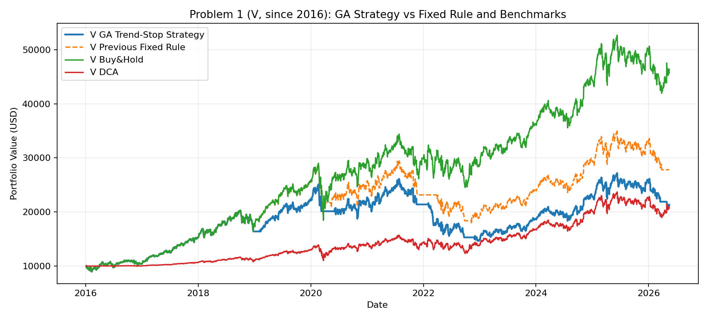

關鍵事件解釋：

以下每一列都用同一個邏輯讀：GA 當時根據 stop / MA / momentum 做出進出場，後續股價變化就是這個決策造成的績效走向。

- 2022-11-25 重新進場 -> 2026-03-18：因為價格重新站上 GA 的 96 日均線 6.70%，且 67 日 momentum 為 2.71%；當時 63 日年化波動約 28.38%，後續股價變化 43.36%。這段進場有效，因為重新進場後到下一次訊號前股價上漲。這和 GA 參數有關：停損較緊：較早出場避險，但容易錯過 V 型反彈; 均線較短：較快重新進場，但假突破風險較高; 動能視窗較短：訊號較快、較敏感。
- 2019-02-01 重新進場 -> 2020-03-09：因為價格重新站上 GA 的 96 日均線 0.92%，且 67 日 momentum 為 4.57%；當時 63 日年化波動約 33.44%，後續股價變化 23.07%。這段進場有效，因為重新進場後到下一次訊號前股價上漲。這和 GA 參數有關：停損較緊：較早出場避險，但容易錯過 V 型反彈; 均線較短：較快重新進場，但假突破風險較高; 動能視窗較短：訊號較快、較敏感。
- 2022-02-01 重新進場 -> 2022-03-07：因為價格重新站上 GA 的 96 日均線 7.64%，且 67 日 momentum 為 0.41%；當時 63 日年化波動約 35.34%，後續股價變化 -17.80%。這段進場失敗，因為重新進場後又下跌，屬於假突破或二次回落。這和 GA 參數有關：停損較緊：較早出場避險，但容易錯過 V 型反彈; 均線較短：較快重新進場，但假突破風險較高; 動能視窗較短：訊號較快、較敏感。

| Date | Action | Price | DD from Peak | GA Mom. | Price vs MA | 63D Vol. | Next Date | Price Move | Interpretation |
| --- | --- | --- | --- | --- | --- | --- | --- | --- | --- |
| 2018-12-24 | Exit | 115.45 | -19.13% | -17.40% | -13.55% | 33.58% | 2019-02-01 | 15.13% | 失敗：出場後股價反彈，策略少吃一段上漲。 |
| 2019-02-01 | Re-entry | 132.93 | -6.89% | 4.57% | 0.92% | 33.44% | 2020-03-09 | 23.07% | 成功：重新進場後股價上漲，策略重新跟上趨勢。 |
| 2020-03-09 | Exit | 163.59 | -19.77% | -7.12% | -9.59% | 32.88% | 2020-06-01 | 13.76% | 失敗：出場後股價反彈，策略少吃一段上漲。 |
| 2020-06-01 | Re-entry | 186.09 | -8.74% | 3.33% | 6.36% | 72.52% | 2021-11-17 | 6.48% | 成功：重新進場後股價上漲，策略重新跟上趨勢。 |
| 2021-11-17 | Exit | 198.15 | -18.02% | -11.70% | -10.53% | 27.99% | 2022-02-01 | 13.31% | 失敗：出場後股價反彈，策略少吃一段上漲。 |
| 2022-02-01 | Re-entry | 224.53 | -7.11% | 0.41% | 7.64% | 35.34% | 2022-03-07 | -17.80% | 失敗：重新進場後價格下跌，屬於二次回落或假突破。 |
| 2022-03-07 | Exit | 184.58 | -18.86% | -2.69% | -11.01% | 33.19% | 2022-03-17 | 11.93% | 失敗：出場後股價反彈，策略少吃一段上漲。 |
| 2022-03-17 | Re-entry | 206.59 | -9.18% | 1.14% | 0.55% | 34.26% | 2022-09-22 | -12.64% | 失敗：重新進場後價格下跌，屬於二次回落或假突破。 |
| 2022-09-22 | Exit | 180.49 | -18.26% | -1.55% | -8.90% | 23.40% | 2022-11-25 | 15.33% | 失敗：出場後股價反彈，策略少吃一段上漲。 |
| 2022-11-25 | Re-entry | 208.15 | -5.73% | 2.71% | 6.70% | 28.38% | 2026-03-18 | 43.36% | 成功：重新進場後股價上漲，策略重新跟上趨勢。 |
| 2026-03-18 | Exit | 298.40 | -19.43% | -8.23% | -9.50% | 22.54% | 2026-04-29 | 11.99% | 失敗：出場後股價反彈，策略少吃一段上漲。 |
| 2026-04-29 | Re-entry | 334.17 | -9.78% | 2.82% | 3.65% | 27.87% | 2026-05-15 | -2.52% | 失敗：重新進場後價格下跌，屬於二次回落或假突破。 |

### MA

- 走勢摘要：MA 從 2016-01-04 到 2026-05-15 累積上漲 455.33%；最強 6 個月是 2020-03-23 到 2020-09-21，漲幅 61.73%。
- 最大價格回撤：2020-02-19 到 2020-03-23，價格最大回撤 -41.00%；策略最大回撤是 2020-02-19 到 2022-10-12，回撤 -32.08%。
- GA 最後參數：trailing stop 29.00%、re-entry MA 133 日、momentum lookback 86 日。相對固定參數的意義：停損較寬：比較不容易被洗出場，但可能承受較深回撤; 均線較長：進場確認較慢、較保守; 動能視窗較短：訊號較快、較敏感。
- 績效比較：GA 策略累積 351.88%，原固定規則 134.35%，DCA 118.73%，Buy&Hold 455.33%。GA 贏原固定規則與 DCA，但輸 Buy&Hold。
- 為什麼比 DCA 好：DCA 分批投入會保留現金，若股票長期上漲，資金進場較慢；本策略大多在趨勢仍有效時保持持倉，因此比 DCA 更早參與上漲。
- 為什麼輸 Buy&Hold：Buy&Hold 在強多頭股票上永遠滿倉；策略只要有出場或重新進場延遲，就會少吃一段反彈。
- GA 是否比原參數好：是。GA 在 2006-2015 訓練期找到更適合此股票的 stop / MA / momentum 組合，2016-2026 測試期也優於原固定規則。
- 關鍵轉折點數量：共 2 次倉位變化，出場 1 次，重新進場 1 次。

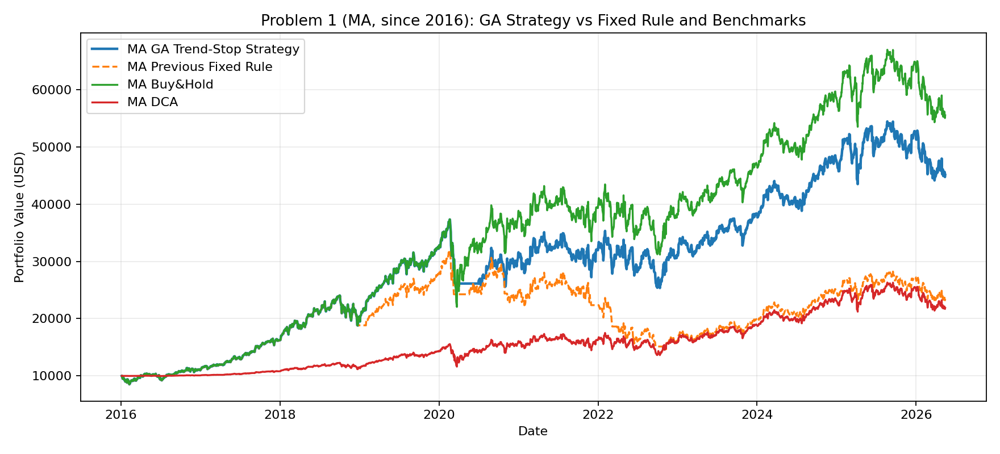

關鍵事件解釋：

以下每一列都用同一個邏輯讀：GA 當時根據 stop / MA / momentum 做出進出場，後續股價變化就是這個決策造成的績效走向。

- 2020-06-30 重新進場 -> 2026-05-15：因為價格重新站上 GA 的 133 日均線 2.04%，且 86 日 momentum 為 3.62%；當時 63 日年化波動約 49.66%，後續股價變化 72.91%。這段進場有效，因為重新進場後到下一次訊號前股價上漲。這和 GA 參數有關：停損較寬：比較不容易被洗出場，但可能承受較深回撤; 均線較長：進場確認較慢、較保守; 動能視窗較短：訊號較快、較敏感。
- 2020-03-12 出場 -> 2020-06-30：因為股價相對高點回撤 -29.91%，已超過 GA stop -29.00%，且價格低於 GA 的 133 日均線 -17.34%；當時 63 日年化波動約 44.06%，後續股價變化 22.63%。這段出場反而吃虧，因為下一次訊號前股價反彈，策略少吃反彈。這和 GA 參數有關：停損較寬：比較不容易被洗出場，但可能承受較深回撤; 均線較長：進場確認較慢、較保守; 動能視窗較短：訊號較快、較敏感。

| Date | Action | Price | DD from Peak | GA Mom. | Price vs MA | 63D Vol. | Next Date | Price Move | Interpretation |
| --- | --- | --- | --- | --- | --- | --- | --- | --- | --- |
| 2020-03-12 | Exit | 233.06 | -29.91% | -10.39% | -17.34% | 44.06% | 2020-06-30 | 22.63% | 失敗：出場後股價反彈，策略少吃一段上漲。 |
| 2020-06-30 | Re-entry | 285.81 | -14.05% | 3.62% | 2.04% | 49.66% | 2026-05-15 | 72.91% | 成功：重新進場後股價上漲，策略重新跟上趨勢。 |

### JPM

- 走勢摘要：JPM 從 2016-01-04 到 2026-05-15 累積上漲 515.30%；最強 6 個月是 2020-09-24 到 2021-03-26，漲幅 70.15%。
- 最大價格回撤：2020-01-02 到 2020-03-23，價格最大回撤 -43.63%；策略最大回撤是 2021-10-22 到 2022-10-11，回撤 -41.71%。
- GA 最後參數：trailing stop 33.00%、re-entry MA 55 日、momentum lookback 87 日。相對固定參數的意義：停損較寬：比較不容易被洗出場，但可能承受較深回撤; 均線較短：較快重新進場，但假突破風險較高; 動能視窗較短：訊號較快、較敏感。
- 績效比較：GA 策略累積 448.19%，原固定規則 380.85%，DCA 189.32%，Buy&Hold 515.30%。GA 贏原固定規則與 DCA，但輸 Buy&Hold。
- 為什麼比 DCA 好：DCA 分批投入會保留現金，若股票長期上漲，資金進場較慢；本策略大多在趨勢仍有效時保持持倉，因此比 DCA 更早參與上漲。
- 為什麼輸 Buy&Hold：Buy&Hold 在強多頭股票上永遠滿倉；策略只要有出場或重新進場延遲，就會少吃一段反彈。
- GA 是否比原參數好：是。GA 在 2006-2015 訓練期找到更適合此股票的 stop / MA / momentum 組合，2016-2026 測試期也優於原固定規則。
- 關鍵轉折點數量：共 4 次倉位變化，出場 2 次，重新進場 2 次。

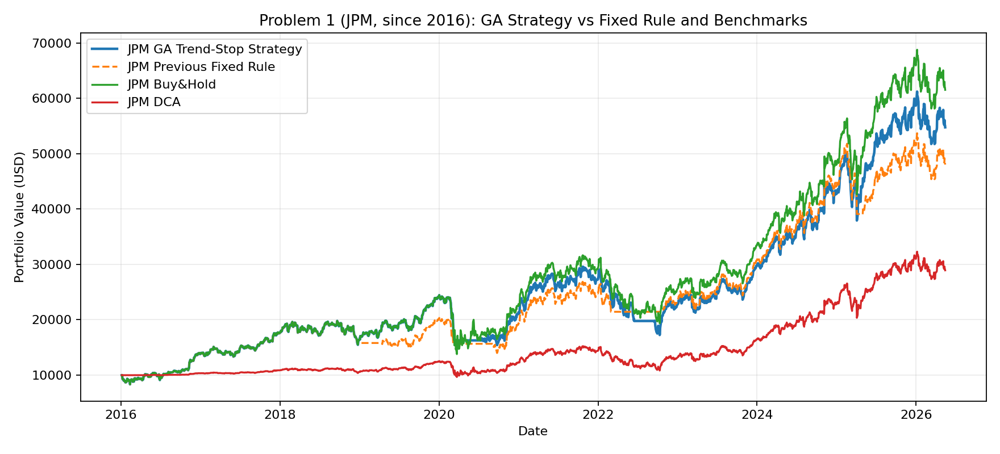

關鍵事件解釋：

以下每一列都用同一個邏輯讀：GA 當時根據 stop / MA / momentum 做出進出場，後續股價變化就是這個決策造成的績效走向。

- 2022-09-15 重新進場 -> 2026-05-15：因為價格重新站上 GA 的 55 日均線 2.02%，且 87 日 momentum 為 0.65%；當時 63 日年化波動約 26.11%，後續股價變化 177.13%。這段進場有效，因為重新進場後到下一次訊號前股價上漲。這和 GA 參數有關：停損較寬：比較不容易被洗出場，但可能承受較深回撤; 均線較短：較快重新進場，但假突破風險較高; 動能視窗較短：訊號較快、較敏感。
- 2020-07-13 重新進場 -> 2022-06-16：因為價格重新站上 GA 的 55 日均線 2.79%，且 87 日 momentum 為 6.62%；當時 63 日年化波動約 52.02%，後續股價變化 21.80%。這段進場有效，因為重新進場後到下一次訊號前股價上漲。這和 GA 參數有關：停損較寬：比較不容易被洗出場，但可能承受較深回撤; 均線較短：較快重新進場，但假突破風險較高; 動能視窗較短：訊號較快、較敏感。
- 2020-03-09 出場 -> 2020-07-13：因為股價相對高點回撤 -33.35%，已超過 GA stop -33.00%，且價格低於 GA 的 55 日均線 -29.72%；當時 63 日年化波動約 39.29%，後續股價變化 6.62%。這段出場反而吃虧，因為下一次訊號前股價反彈，策略少吃反彈。這和 GA 參數有關：停損較寬：比較不容易被洗出場，但可能承受較深回撤; 均線較短：較快重新進場，但假突破風險較高; 動能視窗較短：訊號較快、較敏感。

| Date | Action | Price | DD from Peak | GA Mom. | Price vs MA | 63D Vol. | Next Date | Price Move | Interpretation |
| --- | --- | --- | --- | --- | --- | --- | --- | --- | --- |
| 2020-03-09 | Exit | 78.94 | -33.35% | -24.72% | -29.72% | 39.29% | 2020-07-13 | 6.62% | 失敗：出場後股價反彈，策略少吃一段上漲。 |
| 2020-07-13 | Re-entry | 84.16 | -28.93% | 6.62% | 2.79% | 52.02% | 2022-06-16 | 21.80% | 成功：重新進場後股價上漲，策略重新跟上趨勢。 |
| 2022-06-16 | Exit | 102.51 | -33.08% | -26.73% | -9.83% | 29.99% | 2022-09-15 | 4.83% | 失敗：出場後股價反彈，策略少吃一段上漲。 |
| 2022-09-15 | Re-entry | 107.46 | -29.85% | 0.65% | 2.02% | 26.11% | 2026-05-15 | 177.13% | 成功：重新進場後股價上漲，策略重新跟上趨勢。 |

## 6. Problem 2 Results and Interpretation

| Strategy | Annualized | Cumulative | MDD | Volatility |
| --- | --- | --- | --- | --- |
| buy_and_hold_pair | 20.04% | 20.63% | -16.44% | 23.67% |
| dca_pair | 11.14% | 11.28% | -9.83% | 14.21% |
| pairs_zscore | 0.90% | 0.59% | -4.62% | 5.60% |

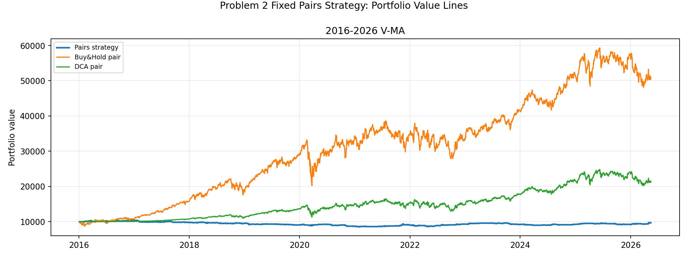

Problem 2 的 pairs strategy 只使用同一組 `V-MA` 跑 `2016-2026` 十年測試窗。若報酬低於 pair 的 Buy&Hold / DCA，但最大回撤和波動較低，這是 market-neutral / hedged 策略常見的現象：它不是靠單邊多頭行情賺錢，而是靠 spread 回歸賺錢；如果市場本身大漲，長抱基準會自然占優。

| Window | Pair | Annualized | Cumulative | MDD | End Equity |
| --- | --- | --- | --- | --- | --- |
| 2016-2026 | V-MA | -0.28% | -2.87% | -18.84% | $9,713 |

### Problem 2 GA Parameter Selection

| Window | Selected Pairs | Lookback | Entry Z | Exit Z | Stop Z | Max Hold | Regime Filter | 交易影響 |
| --- | --- | --- | --- | --- | --- | --- | --- | --- |
| 2016-2026 | V-MA | 81 | 2.22 | 0.44 | 4.20 | 23 | False | 進場門檻更嚴格；持有天數更短 |

GA 的 P2 參數不是拿測試期答案調出來的；正式結果只有 `2016-2026` 這張 10 年圖，使用 2015 年底以前資料訓練 GA，並在 training data 內部切 formation / validation 來評分。

| Window | Pair | Strategy | Cum. | MDD | Vol. | End Equity |
| --- | --- | --- | --- | --- | --- | --- |
| 2016-2026 | V-MA | ga_pairs_zscore | -1.12% | -7.90% | 2.61% | $9,888 |
| 2016-2026 | V-MA | fixed_pairs_zscore | -2.87% | -18.84% | 5.06% | $9,713 |
| 2016-2026 | V-MA | buy_and_hold_pair | 409.40% | -38.97% | 25.12% | $50,940 |
| 2016-2026 | V-MA | dca_pair | 114.05% | -23.23% | 16.07% | $21,405 |

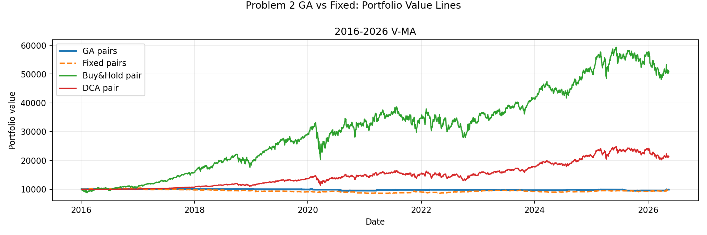

下面這張 zoom chart 只畫 P2 策略本身，不放 Buy&Hold / DCA，避免長抱基準把 y 軸拉高後讓 pair strategy 看起來像水平線。

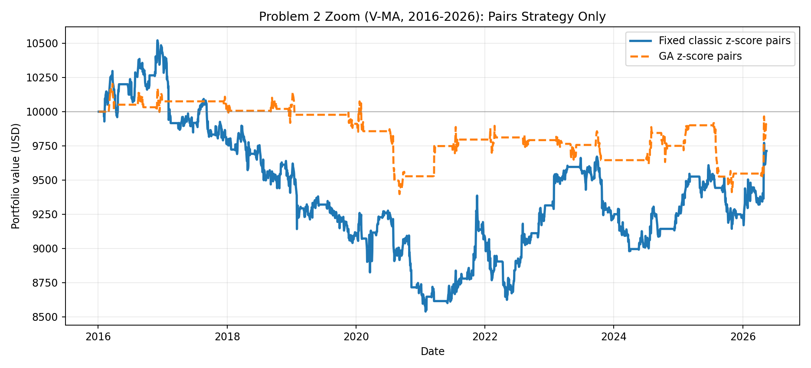

P2 GA 結論需要保守寫：正式測試窗固定使用 `V-MA`，GA 只負責調交易參數。2016-2026 年 `V-MA` GA -1.12%，固定參數 -2.87%，優於固定參數。這代表 GA 不保證一定打敗固定參數；本報告保留 GA 結果，是為了展示參數搜尋與 out-of-sample 驗證，而不是把 GA 包裝成必勝模型。

P2 GA 為什麼贏或輸 fixed：

- 2016-2026：GA 參數 lookback 81、entry_z 2.22、exit_z 0.44、stop_z 4.20、max hold 23。相對 fixed `40/1.5/0/3.5/60`，GA 交易 23 筆、fixed 44 筆；GA 累積 -1.12%、MDD -7.90%，fixed 累積 -2.87%、MDD -18.84%。GA 優於 fixed，但本質是少虧，不是大賺。

P2 關鍵交易解釋：

| Window | Strategy | Trade | Side | Z | Return | Why |
| --- | --- | --- | --- | --- | --- | --- |
| 2016-2026 | fixed_pairs_zscore | 2016-11-17 -> 2017-02-15 | short_spread | 1.87 -> 1.35 | -3.35% | 進場時 V-MA spread 偏高，策略做 short spread，期待 spread 往下回到均值；z 1.87 -> 1.35，z-score 往 0 回歸；同期 V 8.19%、MA 5.21%。到達最長持有天數仍未完整回歸，因此按風控規則出場，單筆報酬 -3.35%。 |
| 2016-2026 | fixed_pairs_zscore | 2024-12-06 -> 2025-03-07 | long_spread | -1.65 -> -1.48 | 4.23% | 進場時 V-MA spread 偏低，策略做 long spread，期待 spread 往上回到均值；z -1.65 -> -1.48，z-score 往 0 回歸；同期 V 11.22%、MA 3.60%。到達最長持有天數仍未完整回歸，因此按風控規則出場，單筆報酬 4.23%。 |
| 2016-2026 | ga_pairs_zscore | 2025-07-16 -> 2025-08-18 | long_spread | -2.23 -> -1.43 | -3.74% | 進場時 V-MA spread 偏低，策略做 long spread，期待 spread 往上回到均值；z -2.23 -> -1.43，z-score 往 0 回歸；同期 V -1.87%、MA 5.15%。到達最長持有天數仍未完整回歸，因此按風控規則出場，單筆報酬 -3.74%。 |
| 2016-2026 | ga_pairs_zscore | 2026-04-10 -> 2026-05-13 | long_spread | -2.26 -> -0.78 | 3.62% | 進場時 V-MA spread 偏低，策略做 long spread，期待 spread 往上回到均值；z -2.26 -> -0.78，z-score 往 0 回歸；同期 V 5.46%、MA -1.61%。到達最長持有天數仍未完整回歸，因此按風控規則出場，單筆報酬 3.62%。 |

### Problem 2 Price and Position Charts

以下圖表才是用來解釋 P2 的主要圖：第一層是 pair 兩檔股票價格走勢，第二層是策略與 benchmark 資產曲線，第三層是 z-score 與持倉線。持倉 `+1` 代表 long spread，`-1` 代表 short spread，`0` 代表空手。

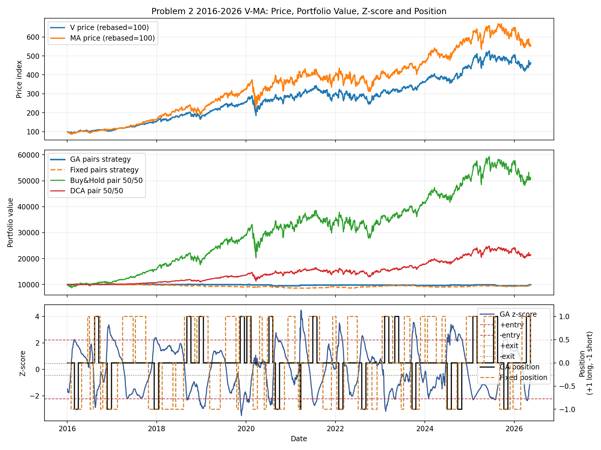

### Problem 2 Trade Log

| Pair | Window | Entry | Exit | Side | Return | Exit Reason | Holding Days |
| --- | --- | --- | --- | --- | --- | --- | --- |
| V-MA | 2016-2026 | 2016-02-02 | 2016-04-28 | short_spread | 2.06% | max_holding_days | 60 |
| V-MA | 2016-2026 | 2016-06-17 | 2016-07-01 | long_spread | 0.22% | mean_reversion | 10 |
| V-MA | 2016-2026 | 2016-07-07 | 2016-08-01 | short_spread | 0.45% | mean_reversion | 17 |
| V-MA | 2016-2026 | 2016-08-10 | 2016-09-27 | long_spread | -0.60% | mean_reversion | 33 |
| V-MA | 2016-2026 | 2016-09-30 | 2016-10-18 | short_spread | 0.77% | mean_reversion | 12 |
| V-MA | 2016-2026 | 2016-11-17 | 2017-02-15 | short_spread | -3.35% | max_holding_days | 60 |
| V-MA | 2016-2026 | 2017-03-29 | 2017-06-23 | long_spread | 0.07% | max_holding_days | 60 |
| V-MA | 2016-2026 | 2017-07-11 | 2017-10-04 | long_spread | -0.81% | max_holding_days | 60 |
| V-MA | 2016-2026 | 2017-10-26 | 2018-01-24 | short_spread | -1.07% | max_holding_days | 60 |
| V-MA | 2016-2026 | 2018-02-15 | 2018-05-14 | short_spread | -0.27% | max_holding_days | 60 |
| V-MA | 2016-2026 | 2018-06-06 | 2018-08-09 | short_spread | -1.58% | mean_reversion | 45 |
| V-MA | 2016-2026 | 2018-08-16 | 2018-11-09 | long_spread | 0.88% | max_holding_days | 60 |
| V-MA | 2016-2026 | 2018-11-26 | 2019-02-25 | long_spread | -3.27% | max_holding_days | 60 |
| V-MA | 2016-2026 | 2019-03-11 | 2019-06-05 | short_spread | 0.34% | max_holding_days | 60 |
| V-MA | 2016-2026 | 2019-07-18 | 2019-10-11 | long_spread | -0.99% | mean_reversion | 60 |
| V-MA | 2016-2026 | 2019-10-17 | 2019-10-31 | short_spread | -0.26% | mean_reversion | 10 |
| V-MA | 2016-2026 | 2019-11-06 | 2020-02-04 | long_spread | -1.28% | max_holding_days | 60 |
| V-MA | 2016-2026 | 2020-02-28 | 2020-04-03 | short_spread | 0.53% | mean_reversion | 25 |
| V-MA | 2016-2026 | 2020-04-21 | 2020-05-12 | long_spread | 1.28% | mean_reversion | 15 |
| V-MA | 2016-2026 | 2020-05-29 | 2020-06-15 | short_spread | 0.39% | mean_reversion | 11 |
| V-MA | 2016-2026 | 2020-06-24 | 2020-08-10 | long_spread | -2.93% | mean_reversion | 32 |
| V-MA | 2016-2026 | 2020-08-17 | 2020-11-10 | short_spread | -2.94% | max_holding_days | 60 |
| V-MA | 2016-2026 | 2020-12-09 | 2021-02-04 | long_spread | -0.74% | mean_reversion | 38 |
| V-MA | 2016-2026 | 2021-03-04 | 2021-03-18 | short_spread | -0.32% | stop_z | 10 |
| V-MA | 2016-2026 | 2021-05-28 | 2021-08-24 | long_spread | 1.96% | max_holding_days | 60 |
| V-MA | 2016-2026 | 2021-09-21 | 2021-11-29 | short_spread | 4.15% | mean_reversion | 48 |
| V-MA | 2016-2026 | 2021-12-10 | 2022-01-06 | long_spread | -1.38% | mean_reversion | 18 |
| V-MA | 2016-2026 | 2022-01-13 | 2022-03-10 | short_spread | -1.11% | mean_reversion | 38 |
| V-MA | 2016-2026 | 2022-04-11 | 2022-06-28 | long_spread | 0.10% | mean_reversion | 53 |
| V-MA | 2016-2026 | 2022-07-06 | 2022-09-21 | short_spread | 2.33% | mean_reversion | 54 |
| V-MA | 2016-2026 | 2022-10-26 | 2022-12-07 | short_spread | 2.28% | mean_reversion | 29 |
| V-MA | 2016-2026 | 2023-01-18 | 2023-04-14 | long_spread | 3.07% | max_holding_days | 60 |
| V-MA | 2016-2026 | 2023-06-22 | 2023-07-12 | short_spread | -0.33% | mean_reversion | 13 |
| V-MA | 2016-2026 | 2023-07-18 | 2023-09-01 | long_spread | -0.42% | mean_reversion | 33 |
| V-MA | 2016-2026 | 2023-09-07 | 2023-11-17 | short_spread | -2.29% | mean_reversion | 51 |
| V-MA | 2016-2026 | 2023-11-27 | 2024-01-03 | long_spread | -0.39% | mean_reversion | 25 |
| V-MA | 2016-2026 | 2024-01-23 | 2024-04-04 | long_spread | -2.71% | mean_reversion | 50 |
| V-MA | 2016-2026 | 2024-05-21 | 2024-06-17 | long_spread | 0.21% | mean_reversion | 18 |
| V-MA | 2016-2026 | 2024-06-26 | 2024-09-20 | short_spread | 1.52% | max_holding_days | 60 |
| V-MA | 2016-2026 | 2024-12-06 | 2025-03-07 | long_spread | 4.23% | max_holding_days | 60 |
| V-MA | 2016-2026 | 2025-04-30 | 2025-07-28 | long_spread | -0.82% | max_holding_days | 60 |
| V-MA | 2016-2026 | 2025-09-04 | 2025-11-28 | short_spread | -1.99% | max_holding_days | 60 |
| V-MA | 2016-2026 | 2025-12-22 | 2026-02-23 | short_spread | 2.17% | mean_reversion | 41 |
| V-MA | 2016-2026 | 2026-03-05 | 2026-05-12 | long_spread | 2.88% | mean_reversion | 47 |

固定參數 P2 共有 44 筆交易，勝 21、負 23、持平 0，平均單筆報酬 0.00%，最常見出場原因是 `mean_reversion`。本次結果要誠實寫成：若 spread 沒有在持有期限內完成回歸，max holding rule 會主動收束風險；若 z-score 偏離後順利回到 0 附近，策略就以 mean_reversion 出場。

### Problem 2 Diagnostics

_No rejected entries: the final P2 design uses classic z-score entries and keeps ADF / half-life as diagnostics rather than hard filters._

前一版把 ADF / half-life 當硬性 regime filter，結果交易太少、資產線幾乎水平。本版改成經典 z-score pairs trading：先讓 spread 偏離時確實進場，再用 stop_z 與 max_holding_days 控制風險。

## 7. Temporal Validation Summary

| Strategy | Annualized | Cumulative | MDD | Volatility |
| --- | --- | --- | --- | --- |
| buy_and_hold | 21.35% | 21.74% | -14.88% | 21.31% |
| dca | 20.32% | 20.71% | -13.71% | 19.76% |
| dual_mom_trend_volcap | 13.50% | 13.64% | -12.31% | 16.81% |

Temporal validation 結果顯示，五檔輪動策略在逐年展開視窗中，平均年化略高於 Buy&Hold / DCA，但累積報酬非常接近。這代表策略不是壓倒性勝利，而是穩定性與風險控制略有改善。

## 8. Limitations and Improvements

- GA 使用 2006-2015 訓練期選參數；若某些股票在 2016-2026 測試期輸給原固定參數，代表 GA 仍有 overfitting / whipsaw 風險。
- Walk-forward GA 改善了單一切割的疑慮：2016-2026 年度平均中五檔都贏固定參數與 DCA，但它仍多數輸給 Buy&Hold，表示策略價值主要在風控與規則可解釋，不是保證最高報酬。
- 停損參數不能搜尋得太寬；如果允許 10%-15% 的過緊停損，GA 在訓練期可能很好看，但測試期容易被快速反彈洗出去。
- Buy&Hold 在強多頭市場很難被打敗；策略出場後若市場快速 V 型反彈，會有延遲進場問題。
- DCA 的優勢是降低一次投入時點風險；若市場震盪或先跌後漲，DCA 可能更穩。
- Problem 2 固定使用 `V-MA`，優點是故事一致、產業邏輯清楚；限制是它不一定是每個 training window 統計排名第一的 pair，因此報告要把「有名且可解釋」與「統計排名」分開說明。
- P2 GA 不保證穩定改善固定參數：GA 只用訓練期 validation 選參數，若 validation period 的 spread 型態和 2016-2026 測試期不同，仍可能輸給簡單固定規則。這說明 GA 參數最佳化仍需要 walk-forward 驗證。
- 後續可改進：加入更多候選 pair、使用 sector-neutral pair universe、或把 P2 GA 的 fitness 改成同時要求交易次數與跨 pair 穩定性，但不能把模型做得過度複雜。

## 9. Individual Contribution Statement

Gavin: data collection, Python strategy implementation, benchmark construction, temporal validation, chart generation, performance interpretation, Markdown report, and PPT organization. If this is submitted as a group project, replace this section with each member's actual contribution.

## 10. Reproducibility

Run the following commands from the `專題二` folder:

```bash
python3 scripts/run_term_project2_recommended.py
PYTHONDONTWRITEBYTECODE=1 python3 scripts/build_report_assets.py
PYTHONDONTWRITEBYTECODE=1 python3 scripts/build_final_report.py
```

Main outputs:

- `report/final_report.md`
- `ppt/index.html`
- `figures/reco_problem1_*_vs_benchmarks.png`
- `figures/reco_problem1_ga_walkforward_cumulative.png`
- `figures/reco_problem2_vs_benchmarks.png`
- `figures/reco_problem2_ga_vs_fixed.png`
- `figures/reco_problem2_2016-2026_v_ma_strategy_zoom.png`
- `results/reco_problem1_turning_points.csv`
- `results/reco_problem1_stock_phases.csv`
- `results/reco_problem1_ga_walkforward*.csv`
- `results/reco_problem2_trade_log.csv`
- `results/reco_problem2_reject_log.csv`
- `results/reco_problem2_ga_*.csv`
